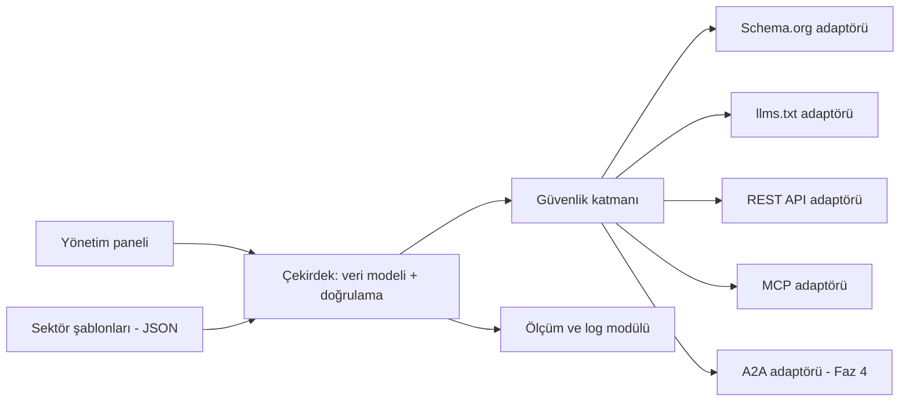

# AI Hazır Site Projesi – İş Planı ve Yazılım Yol Haritası

Sep 26, 2026 · @Efe

## Özet

AI Hazır Site, WordPress sitelerinin "ne satıyorum, ne arıyorum, ne tedarik edebilirim" bilgisini AI agentların doğrudan okuyup kullanabileceği biçimde yayınlayan bir eklentidir. Hedef: 13. haftada pilot sitede çalışan MVP, 6. ayın sonunda pilot ağdan ölçülmüş "önce/sonra" verisi.

- **Ürün:** Tek bir WordPress eklentisi ve içinde AI Agent Uyum Paketi. Sektör şablonlarıyla her siteye ayarlardan uyarlanır, kod değişmez.
- **Pilot ağ:** Kablo dağıtıcı, kablo fabrikası, ihracat firması, hukuk firması, turizm firması ve 3–4 turizm portalı.
- **Satış argümanı:** Kendi ağımızdan toplanan somut AI trafiği ve teklif verisi.
- **Geliştirme yöntemi:** Yinelemeli + artımlı geliştirme. Her artım tek başına çalışır, test edilmiştir ve kullanılabilirdir. Yeni artım, çalışan sistemi bozmadan eklenir.

## İş planı

KOBİ'lerin satıcı tarafı AI agentlara kapalı; bu boşluğu WordPress üzerinden, kendi pilot ağımızla kanıtlayarak dolduruyoruz.

### Problem

AI agentlar tedarikçi arıyor, fiyat ve stok soruyor, teklif topluyor. KOBİ siteleri ise insanlar için yapılmış: bilgi resimlerde, PDF'lerde ve dağınık sayfalarda. Agent bilgiyi ya bulamıyor ya da yanlış okuyor.

### Çözüm

Firma sahibi bilgisini bir kez, basit formlarla girer. Eklenti bunu dört kanaldan AI'lara sunar: Schema.org etiketleri, llms.txt dosyası, REST API ve MCP. İleride A2A ile agentlar arası konuşma, sonra UCP (Universal Commerce Protocol) ile AI asistanlarının içinden satın alma eklenir (bkz. "İkinci ürün adayı: UCP"). Yazma işlemleri (teklif) her zaman insan onayından geçer.

**AI Agent Uyum Paketi:** Eklenti önce siteyi tarar ve 100 üzerinden bir "AI uyum puanı" ile eksik listesi verir. Ardından bir sihirbaz eksikleri adım adım tamamlatır, AI botlarının erişimini panelden yönetmeyi sağlar ve sonunda müşterinin kullanabileceği bir uyum raporu ile "AI Hazır" rozeti üretir. Ücretsiz tarama, satışta ilk kapıyı açan araçtır.

### Hedef pazar

1. **Birinci halka:** Mevcut müşteriler ve pilot ağ.
2. **İkinci halka:** Türkiye'de WordPress kullanan B2B KOBİ'ler (kablo, elektrik, ihracat, turizm).
3. **Üçüncü halka:** Turizm portalları ve WordPress ajansları üzerinden toplu satış.

### Pilot ağ

| Site | Tür | Sektör şablonu | AI'a açılacak | Yazma izni |
| --- | --- | --- | --- | --- |
| Kablo ve elektrik malzemeleri | Dağıtıcı | Ürün | Ürün, stok, teslim süresi, aranan malzemeler | Teklif talebi |
| Kablo fabrikası | Üretici | Ürün | Üretim kapasitesi, standartlar, teslim süresi | Teklif talebi |
| İhracat firması | İhracatçı | İhracat ürünü | Ürün grupları, GTİP, pazarlar, teslim şekli | Teklif ve numune talebi |
| Turizm firması | Tur operatörü | Tur/etkinlik | Turlar, tarih, kontenjan, iptal koşulları | Rezervasyon ön talebi |
| Turizm portalları (3–4) | Portal | Portal modu | Listelenen işletmeler ve turlar | Yönlendirme talebi |
| Global hukuk firması | Hizmet | Hizmet | Uzmanlık alanları, ofisler, diller | Yok (sadece okuma) |

### Rakipler ve konumumuz

| Oyuncu | Ne yapıyor | Bizim farkımız |
| --- | --- | --- |
| Scrunch | Büyük markalar için AI'a özel site sürümü | KOBİ fiyatı, WordPress içinde, yazma yetenekleri |
| Genel WordPress MCP eklentileri | İçerik ve medya yönetimini AI'a açar | Alım-satım ve tedarik verisine özel |
| Speya, Alibaba Accio | Alıcı tarafında tedarikçi arayan agentlar | Biz bu agentların okuyacağı satıcı verisini üretiyoruz |
| Rye, Nekuda | Agent ödeme ve checkout altyapısı | Ödeme yapmıyoruz; keşif ve teklif katmanındayız |

### Gelir modeli

| Paket | İçerik | Kime |
| --- | --- | --- |
| Ücretsiz | Uyum taraması ve puan, veri formları, Schema.org, llms.txt | Herkes (kullanıcı kazanımı) |
| Pro (yıllık abonelik) | MCP, teklif kutusu, sektör şablonları, rapor paneli, uyum sihirbazı, uyum raporu ve AI Hazır rozeti | B2B KOBİ'ler |
| Portal lisansı | Portal modu, çok işletme yönetimi | Turizm ve sektör portalları |
| Ajans lisansı | Çoklu site yönetimi, merkezi güncelleme | WordPress ajansları |
| Kurulum hizmeti | Veri girişi ve yapılandırma | Zamanı olmayan firmalar |

Fiyatlar pilot sonuçlarından sonra belirlenecek; açık kararlar bölümüne bakınız.

### Riskler

| Risk | Etki | Önlem |
| --- | --- | --- |
| AI agent trafiği beklenenden düşük kalır | Satış argümanı zayıflar | "Garanti satış" değil "görünürlük ve hazırlık" vaat et; ölçümü erken başlat |
| MCP Adapter ve A2A standartları değişir | Bakım yükü artar | Adaptör katmanı: standart değişince sadece adaptör güncellenir |
| Teklif kanalı spam alır | Müşteri memnuniyetsizliği | Hız sınırı, spam skoru, insan onayı |
| Bayat veri (dolu tur "müsait" görünür) | Güven kaybı | Veriye son güncelleme tarihi ve geçerlilik süresi |
| Hukuk sitesinde reklam kuralı ihlali | Mesleki yaptırım | Sadece okuma, metni firma onaylar |
| KVKK | Hukuki risk | Kişisel veri AI'a açılmaz; müşteriden yazılı onay |

### Başarı ölçütleri

- AI bot ziyaret sayısı (önce/sonra, site başına haftalık).
- AI platformlarından gelen insan ziyaretçi sayısı.
- Haftalık 10 soruluk testte AI cevaplarında görünme oranı.
- AI kaynaklı teklif ve talep sayısı.
- Pilot müşteri memnuniyeti ve ücretli pakete geçiş sayısı.

## Genel yol haritası

Proje 5 faz ve 13 artımdan oluşur; MVP 13. haftada, A2A demosu 6. ayın sonunda hazır olur. Her artım bir önceki artımın üzerine eklenir ve kendi başına kullanılabilir bir şey teslim eder.

### Fazlar

| Faz | Hafta | Amaç | Faz sonu kapısı (geçiş şartı) |
| --- | --- | --- | --- |
| Faz 0 – Hazırlık ve ölçüm | 1–3 | Önce durumu ölçmek | Tüm sitelerde en az 3 haftalık eklentisiz veri |
| Faz 1 – Okunabilir site | 3–8 | AI'ın siteyi doğru okuması | Kablo sitesinde Schema.org doğrulaması hatasız |
| Faz 2 – AI kapısı (MVP) | 9–13 | AI'ın sorgulayıp teklif bırakması | Claude ile uçtan uca teklif senaryosu başarılı |
| Faz 3 – Yaygınlaştırma | 14–20 | Tüm pilot ağa kurulum | 10 sitede sorunsuz çalışma, ilk önce/sonra raporu |
| Faz 4 – Agentlar arası | 21–26 | Fabrika ile dağıtıcı agentlarının konuşması | Canlı A2A eşleştirme demosu |

### Artım listesi

| No | Artım | Tek başına ne işe yarar? | Kabul testi | Hafta |
| --- | --- | --- | --- | --- |
| A0 | Ölçüm aracı: AI bot sayacı ve haftalık 10 soru testi | Hangi AI'ların siteye geldiğini raporlar | Log'daki bilinen botlar doğru sayılıyor | 1–3 |
| A1 | Eklenti iskeleti, veri modeli, yönetim formları | Firma verisini panelden düzenli girer | Kayıt ekle, düzenle, sil; eski verilere dokunmaz | 3–4 |
| A2 | Schema.org (JSON-LD) çıktısı | AI ve arama motorları ürünleri doğru okur | Schema doğrulayıcıda sıfır hata | 5 |
| A3 | llms.txt ve AI katalog sayfası | AI'lara firmanın tek sayfalık özeti | Dosya her veri değişikliğinde güncelleniyor | 6 |
| A4 | Sektör şablonları (ürün, ihracat, hizmet, tur) | Aynı eklenti 4 sektörde çalışır | 4 şablonun her biriyle A1–A3 testleri geçiyor | 7–8 |
| A5 | REST API (sadece okuma) | Yazılımlar veriyi JSON olarak çeker | Uç noktalar şemaya uygun cevap veriyor | 9 |
| A6 | Abilities + MCP (sadece okuma) | Claude gibi AI'lar veriyi doğrudan sorgular | Claude ile "stokta X var mı" sorusu doğru cevaplanıyor | 10–11 |
| A7 | Teklif kutusu + güvenlik katmanı | AI'lar teklif bırakır, firma onaylar | Hız sınırı, spam filtresi ve onay akışı testleri | 12–13 |
| A8 | Çoklu dil | İhracat sitesi yabancı agentlara cevap verir | TR ve EN çıktılar eşleşiyor | 14–15 |
| A9 | Portal modu | Tek portal, çok işletmeyi AI'a sunar | Tek sorguyla birden çok işletmede arama | 16–17 |
| A10 | Merkezi güncelleme ve rapor paneli | Tüm siteler tek yerden güncellenir, sonuçlar görünür | Kanarya kurulum ve geri alma testi | 18–20 |
| A11 | Eşleştirme motoru | İhtiyaç ile tedariki otomatik eşleştirir | Test veri setinde beklenen eşleşmeler bulunuyor | 21–23 |
| A12 | A2A kartviziti ve agent | Fabrika ve dağıtıcı agentları konuşur | Uçtan uca demo, son onay insanda | 24–26 |

### AI Agent Uyum Paketi artımları

Uyum paketi ana artımlara paralel, küçük ve bağımsız artımlarla eklenir; ilk tarama 3. haftada kullanılabilir olur.

| No | Artım | Tek başına ne işe yarar? | Kabul testi | Hafta |
| --- | --- | --- | --- | --- |
| U1 | Uyum taraması ve puan | Sitenin AI uyum puanını ve eksik listesini verir | Pilot sitelerde puan, elle yapılan kontrolle tutarlı | 2–3 |
| U2 | AI bot erişim ayarları | Hangi AI botlarının siteye girebileceği panelden yönetilir | Ayar değişince robots.txt doğru güncelleniyor, önceki kurallar korunuyor | 4 |
| U3 | Uyum sihirbazı | Eksikleri adım adım, tek tıkla tamamlatır | Sihirbaz sonrası puan artışı taramayla doğrulanıyor | 8 |
| U4 | Uyum raporu ve AI Hazır rozeti | Müşteriye gösterilebilir PDF rapor ve site rozeti | Rapor, taramadaki verilerle birebir eşleşiyor | 13 |
| U5 | Yeni standartlara uyum (WebMCP, A2A kartviziti) | Gelişen standartlar puana ve sihirbaza eklenir | Yeni kontrol eklenince eski puanlama testleri bozulmuyor | 20 ve sonrası, sürekli |

Tarama ileride eklenti kurulmadan, sadece site adresi girilerek de çalışabilecek şekilde tasarlanır; bu hali satış ekibinin ön görüşme aracı olur.

### İkinci ürün adayı: UCP (Universal Commerce Protocol)

> Taslak (2026-09-28), onay bekliyor. Kaynaklar: ucp.dev, github.com/Universal-Commerce-Protocol/ucp, Google Developers
> "Under the Hood: UCP" ve "Create a UCP profile" belgeleri.

**Nedir?** Google ve Shopify'ın Ocak 2026'da (NRF) duyurduğu, Apache 2.0 lisanslı açık standart. AI agentlarının bir
işletmede ürün keşfetmesini, yetenek pazarlığını, sepet ve ödemeyi (checkout) ve satış sonrası sipariş bilgisini
tanımlar. Google AI Mode ve Gemini'de ABD'de canlı; Mart 2026 güncellemesiyle Catalog, Cart ve Identity Linking
eklendi; konaklama (Booking) taslak aşamasında.

**Nasıl çalışır?**

- İşletme yeteneklerini `/.well-known/ucp` adresindeki bir profilde yayınlar. Profilde tarih biçiminde sürüm
  (ör. `2026-01-23`), servisler (`dev.ucp.shopping`), yetenekler (`dev.ucp.shopping.checkout`, catalog, cart, order,
  identity linking), ödeme işleyicileri (`payment_handlers`) ve imza anahtarları (JWK) bulunur.
- Taşıma: REST, MCP ve A2A. Bizim A5, A6 ve A12 kanallarımız bu üçünün de altyapısını zaten kurdu.
- Ödeme: AP2 (Agent Payments Protocol; kullanıcı onayının kriptografik kanıtı), Google Pay, Shop Pay gibi işleyiciler.

**Bizim ürünümüze uyumu**

| UCP yeteneği | Bizde karşılığı | Uyum |
| --- | --- | --- |
| Catalog (ürün arama ve gezinme) | A1 veri modeli, A5 REST, A6 MCP okuma | Yüksek: veriyi UCP şemasına eşleyen bir adaptör yeter |
| Cart ve Checkout | Yok (teklif kutusu var, satın alma yok) | Düşük: WooCommerce ve ödeme sağlayıcı gerekir |
| Order (sipariş sonrası) | Yok | WooCommerce ile |
| Identity Linking (OAuth 2.0) | Yok | Checkout ile birlikte |
| Booking (konaklama, taslak) | A4 tur şablonu | Orta; taslak olgunlaşınca turizm portalı için |

B2B teklif isteği (RFQ) UCP'de henüz yok. Bizim pilot ağımızın büyük kısmı (kablo, ihracat, hukuk) teklif üzerinden
çalışır; bu yüzden UCP en çok **perakende satış yapan (WooCommerce kullanan) KOBİ'ler** için ikinci ürün olarak
anlamlıdır. Mevcut ürün (AI Hazır Site) bilgi ve teklif katmanı olarak kalır; UCP ürünü onun üzerine satın alma katmanı
ekler.

**Önerilen artımlar (taslak)**

| No | Artım | Değer | Kabul testi |
| --- | --- | --- | --- |
| C1 | UCP profili (`/.well-known/ucp`) ve Catalog yeteneği (salt okuma) | Gemini / AI Mode katalogdaki ürünleri UCP ile bulur | Profil resmi şemaya uygun; katalog yanıtları A5 ile aynı veriden |
| C2 | WooCommerce köprüsü: Cart ve Checkout (REST bağlaması) | AI asistanı içinden sepet ve ödeme | Resmi uyumluluk testleri; ödeme test modunda uçtan uca |
| C3 | Order ve Identity Linking | Sipariş durumu ve hesap bağlama | Sipariş olayları imzalı; OAuth akışı test modunda |
| C4 | AP2 ödeme ve Booking (turizm, taslak olgunlaşınca) | Turlarda doğrudan rezervasyon | Konaklama/tur rezervasyonu test ortamında |
| U6 | Uyum taramasına UCP kontrolü | Profil var mı, geçerli mi? | Eski puanlama testleri bozulmuyor (U5 kuralı) |

**Riskler**

- Spesifikasyon tarih sürümlü ve hızlı değişiyor; adaptör katmanı (UCP yalnızca `src/Adapters/UCP`) bu riski sınırlar.
- Checkout; vergi, iade ve ödeme mevzuatı (Türkiye'de BDDK / ödeme kuruluşu kuralları) gerektirir; ödeme verisi
  eklentiden geçmemeli, ödeme sağlayıcıda kalmalı.
- Google tarafında Merchant Center hesabı ve onay süreci; Türkiye'de kullanılabilirlik henüz belirsiz.

### Sitelere kurulum sırası

1. **Kablo dağıtıcı:** A1'den itibaren pilot site. Her artım önce burada test ortamında, sonra canlıda denenir.
2. **Kablo fabrikası:** A4 ile birlikte. Eşleştirme demosunun ikinci ucu.
3. **İhracat firması:** A8 ile birlikte.
4. **Turizm portalı (biri) ve turizm firması:** A9 ile birlikte; diğer portallar sırayla.
5. **Hukuk firması:** A10 ile birlikte, sadece okuma modunda, firma metni onayladıktan sonra.

## Yazılım mühendisliği

Mimari "çekirdek + adaptörler" üzerine kurulur: veri tek bir çekirdekte durur, her AI kanalı ayrı bir adaptördür. Böylece yeni bir kanal (örneğin A2A) eklemek çekirdeğe ve mevcut kanallara dokunmaz; artımlı geliştirme kuralı mimari düzeyde garanti altına alınır.

### Mimari



Kural: adaptörler çekirdeği sadece okur, birbirini hiç çağırmaz. Yazma işlemleri (teklif) tek bir çekirdek fonksiyonundan geçer.

### Modüller

| Modül | Sorumluluk | İlk artım |
| --- | --- | --- |
| Çekirdek (Core) | Veri modeli, kayıt, doğrulama, sürüm bilgisi | A1 |
| Şablon motoru | Sektöre göre alanları ve etiketleri üretir | A4 |
| Schema adaptörü | Veriyi JSON-LD'ye çevirir | A2 |
| llms.txt adaptörü | Özet dosyayı üretir ve önbelleğe alır | A3 |
| REST adaptörü | Okuma uç noktaları | A5 |
| MCP adaptörü | Abilities kaydı, MCP Adapter üzerinden yayın | A6 |
| Teklif modülü | Teklif alma, onay akışı, bildirim | A7 |
| Güvenlik | Yetki, hız sınırı, spam skoru, işlem kaydı | A7 |
| Ölçüm | AI bot tespiti, raporlama | A0 |
| Dağıtım | Merkezi güncelleme, lisans kontrolü | A10 |
| Eşleştirme | İhtiyaç–tedarik eşleştirme | A11 |
| A2A adaptörü | Agent kartviziti ve görev alma | A12 |
| Uyum paketi | Tarama, puanlama, sihirbaz, bot erişim ayarları, rapor ve rozet | U1 |

### Veri modeli

| Varlık | Temel alanlar | Not |
| --- | --- | --- |
| Firma profili | Ad, sektör, ülke, diller, iletişim, sertifikalar | Site başına bir kayıt |
| İlan (Listing) | Tür (satılan / aranan / tedarik edilebilen), başlık, kategori, miktar, birim, fiyat aralığı, bölge, teslim süresi, geçerlilik tarihi | Tüm sektörlerde ortak |
| Sektör özellikleri | Şablona göre değişen alanlar (kesit, GTİP, tur tarihi, uzmanlık alanı) | JSON olarak saklanır, şema ile doğrulanır |
| Teklif (Inquiry) | Kaynak (AI / insan), ilan, içerik, durum (yeni, onaylandı, reddedildi), spam skoru | Onaysız teklif hiçbir yere gitmez |
| İşlem kaydı | Zaman, istemci, kanal, işlem, sonuç | Denetim ve rapor için |

Veritabanı kuralı: şema değişiklikleri sadece ekleme şeklinde yapılır (yeni alan, yeni tablo). Mevcut alan silinmez veya yeniden adlandırılmaz; böylece eski sürüm verisi her zaman okunabilir.

### Algoritmalar

**1. AI bot tespiti (A0).** Üç adımda sınıflandırma yapılır: kullanıcı ajanı (user-agent) listesiyle eşleştirme, bilinen botlar için ters DNS veya yayınlanmış IP aralığı doğrulaması, ve ziyaretin türünü belirleme (eğitim tarayıcısı, arama tarayıcısı, kullanıcı adına çalışan agent). Doğrulanamayan "sahte bot" ayrı sayılır.

**2. Schema eşleme (A2).** Her şablon alanı bir Schema.org özelliğine bir tabloyla bağlanır. Satılan ilanlar Offer/Product, aranan ilanlar Demand, firma Organization olarak çıkar. Çıktı her üretimde otomatik doğrulanır; hatalı çıktı yayınlanmaz, son geçerli sürüm kalır.

**3. Önbellek ve tazelik (A3, A5).** Çıktılar veri değiştiğinde yeniden üretilir. Her ilanın geçerlilik tarihi vardır; süresi dolan ilan AI kanallarından otomatik kalkar. Turlarda kontenjan için kısa geçerlilik süresi kullanılır.

**4. Hız sınırı (A7).** İstemci başına "jeton kovası" (token bucket) yöntemi: her istemcinin dakikalık ve günlük hakkı vardır, aşınca istek reddedilir ve kaydedilir.

**5. Spam skoru (A7).** Kurallara dayalı puan: aynı kaynaktan kısa sürede çok teklif, boş veya anlamsız içerik, ilanla alakasız talep. Eşiği aşan teklif karantinaya alınır. Tüm teklifler, skor ne olursa olsun, insan onayına düşer.

**6. Eşleştirme (A11).** Önce kesin filtreler uygulanır: kategori, standart, bölge, teslim süresi sınırı. Kalan adaylar ağırlıklı bir puanla sıralanır:

```latex
S = w_1 \cdot \text{Özellik uyumu} + w_2 \cdot \text{Miktar karşılama} + w_3 \cdot \text{Teslim uyumu} + w_4 \cdot \text{Fiyat örtüşmesi}, \quad \sum w_i = 1
```

Başlangıç ağırlıkları eşit alınır; pilot verisiyle ayarlanır. Her eşleşmenin neden önerildiği (hangi kriter kaç puan aldı) kullanıcıya gösterilir.

**7. Uyum puanı (U1).** Site yedi kriterde kontrol edilir ve toplam 100 puan üzerinden değerlendirilir. Her eksik, puana etkisi ve nasıl düzeltileceğiyle birlikte listelenir; en çok puan kazandıracak eksik en üstte gösterilir.

| Kriter | Ne kontrol edilir? | Puan |
| --- | --- | --- |
| Yapılandırılmış veri | Schema.org etiketleri var ve hatasız mı? | 20 |
| İçerik okunabilirliği | Fiyat, stok, iletişim metin olarak mı, yoksa resim veya PDF içinde mi? | 20 |
| Makine arayüzü | REST API ve MCP bağlantısı açık mı? | 20 |
| AI bot erişimi | robots.txt AI botlarını engelliyor mu, sayfalar erişim hatası veriyor mu? | 15 |
| llms.txt | Dosya var ve güncel mi? | 10 |
| Tazelik | İlanlarda güncelleme ve geçerlilik tarihi var mı? | 10 |
| İleri standartlar | Agent kartviziti veya WebMCP desteği var mı? | 5 |

### Teknoloji yığını

| Katman | Seçim | Neden |
| --- | --- | --- |
| Platform | WordPress 6.9 ve üstü | Abilities API çekirdekte |
| Dil | PHP 8.1 ve üstü (hedefimiz) | Tip güvenliği, modern sözdizimi |
| AI kanalı | Resmi MCP Adapter (Composer paketi) | WordPress'in resmi MCP entegrasyonu |
| Bağımlılık yönetimi | Composer | Standart |
| Yerel ortam | wp-env (Docker) | Herkes aynı ortamda çalışır |
| Test | PHPUnit + WordPress test paketi, uçtan uca için Playwright | Birim, entegrasyon ve arayüz testi |
| Kod kalitesi | PHPStan, PHPCS (WordPress kodlama standartları) | Hataları erken yakalar |
| CI/CD | GitHub Actions | Her değişiklikte otomatik test |

## Geliştirme süreci

Her artım 2 haftalık bir yinelemede (iterasyonda) geliştirilir ve "Bitti Tanımı"nı karşılamadan bir sonraki artıma geçilmez. Temel kural: her artım tek başına çalışır, test edilmiştir, kullanılabilirdir ve mevcut sistemi bozmaz.

### Bir yinelemenin döngüsü

1. **Planla (1. gün):** Artımın kapsamı, kabul testi ve riskleri yazılır. Kapsam büyükse ikiye bölünür.
2. **Tasarla (1–2. gün):** Veri değişikliği, adaptör arayüzü ve test senaryoları belirlenir.
3. **Geliştir ve test et (3–8. gün):** Önce test, sonra kod. Her gün küçük birleştirmeler.
4. **Doğrula (9. gün):** Tüm eski ve yeni testler çalışır; pilot sitenin test kopyasında denenir.
5. **Yayınla (10. gün):** Pilot sitede canlıya alınır, 48 saat izlenir.
6. **Değerlendir:** Kısa bir geriye dönük toplantı; öğrenilenler bir sonraki planlamaya girer.

### Bitti Tanımı (Definition of Done)

- [ ] Kabul testi geçti.
- [ ] Yeni kodun birim ve entegrasyon testleri yazıldı.
- [ ] Önceki tüm artımların testleri hâlâ geçiyor (regresyon).
- [ ] Kod incelemesi yapıldı; PHPStan ve PHPCS temiz.
- [ ] Veritabanı değişikliği sadece ekleme şeklinde ve geri alınabilir.
- [ ] Yeni özellik bir ayar anahtarıyla kapatılabilir.
- [ ] Pilot sitenin test kopyasında denendi.
- [ ] Kullanıcı notu ve değişiklik kaydı (changelog) yazıldı.
- [ ] Geri alma adımı denendi.

### "Mevcut sistemi bozmama" güvenceleri

| Güvence | Nasıl uygulanır |
| --- | --- |
| Özellik anahtarları | Her yeni özellik varsayılan olarak kapalı gelir, ayarlardan açılır. Sorun olursa kapatılır, kod geri alınmaz. |
| Sözleşme testleri | Schema, llms.txt, REST ve MCP çıktılarının örnekleri kaydedilir; beklenmeyen değişiklik testi kırar. |
| Sadece ekleyen veritabanı | Alan silinmez, adı değişmez; her geçiş için bir geri alma betiği yazılır. |
| Anlamsal sürümleme | 1.2.0 → 1.3.0 yeni özellik, 1.3.1 hata düzeltme. Kırıcı değişiklik gerekiyorsa 2.0.0 ve geçiş rehberi. |
| Kanarya yayını | Önce pilot site, 48 saat sonra diğerleri, sırayla. |
| Geri alma | Önceki sürüm paketi her zaman saklanır; tek komutla dönülür. |

### Kod ve dal yönetimi

- Ana dal (main) her zaman yayınlanabilir durumdadır.
- Her iş kısa ömürlü bir dalda yapılır ve en geç birkaç günde birleştirilir.
- Birleştirme için otomatik testlerin geçmesi ve bir kod incelemesi şarttır.
- Her artım sonunda bir sürüm etiketi (tag) atılır.

### Ortamlar

| Ortam | Amaç |
| --- | --- |
| Yerel (wp-env) | Geliştirme ve birim testleri |
| CI (GitHub Actions) | Her değişiklikte tüm testler, farklı PHP ve WordPress sürümleriyle |
| Test kopyası (staging) | Her pilot site için gerçek veriyle deneme |
| Canlı | Kanarya sırasıyla yayın |

## Ekip, kontrol listesi ve açık kararlar

MVP için en az 1 tam zamanlı WordPress/PHP geliştirici ve bir ürün sahibi yeterlidir; Faz 3'ten sonra ikinci bir geliştirici gerekir.

### Ekip

| Rol | Sorumluluk | Zaman |
| --- | --- | --- |
| Ürün sahibi (siz) | Öncelikler, müşteri ilişkisi, kabul testleri | Yarı zamanlı |
| WordPress/PHP geliştirici | Çekirdek, adaptörler, testler | Tam zamanlı |
| İkinci geliştirici | Portal modu, eşleştirme, A2A | Faz 3'ten itibaren |
| Test / QA | Pilot sitelerde deneme, regresyon | Yarı zamanlı |
| Hukuk ve KVKK danışmanı | Onay metinleri, hukuk sitesi kuralları | İhtiyaç halinde |

### Başlamadan önce kontrol listesi

- [ ] Tüm pilot sitelerde WordPress 6.9 veya üstü.
- [ ] Her site için test kopyası (staging) açıldı.
- [ ] Tüm sitelerin tam yedeği alındı.
- [ ] Sunucu loglarına erişim sağlandı (A0 ölçümü için).
- [ ] Müşterilerden yazılı onay alındı.
- [ ] GitHub deposu ve CI kuruldu.
- [ ] Haftalık 10 soruluk AI test listesi hazırlandı.

### Açık kararlar

- [ ] Geliştirme kendi ekibimizle mi, dış kaynakla mı yapılacak?
- [ ] Eklentinin adı ve marka.
- [ ] Ücretsiz ve Pro paket arasındaki sınır ve fiyatlar (pilot sonrası).
- [ ] Merkezi güncelleme sunucusu nerede barınacak?
- [ ] Turizm firması hangi rezervasyon sistemini kullanıyor; entegrasyon mümkün mü?
- [ ] Hukuk firması AI'a açılacak metni ne zaman onaylayacak?
- [ ] Proje bütçesi ve 6 aylık maliyet tavanı.
- [ ] UCP: ikinci ürün mü, AI Hazır Site'nin Pro modülü mü? İlk hedef kitle WooCommerce kullanan perakende KOBİ'ler mi?
- [ ] UCP'nin Türkiye'de (Google AI Mode / Gemini alışverişi) ne zaman kullanılabilir olacağı takip edilecek.
- [ ] "Walkthrough planı" hangi belge? (UCP oraya da eklenecek.)
